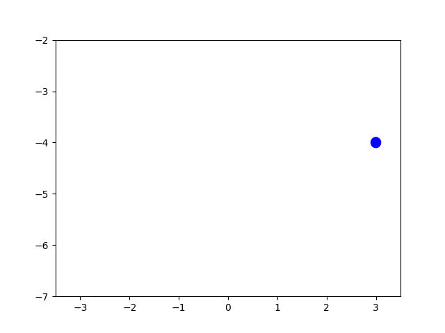

# Pendulum
Numerical solution of the differential-algebraic system of equations describing the motion of a pendulum

## Problem

In the notebook the Cauchy problem is formulated. I.e. a differential-algebraic system of equations is given that describes the motion of a pendulum. Initial conditions and solving limitations are given.

## Numerical solution

While solving the problem, the system is transformed to a system of ordinary differential equations.

To solve the system fourth order Runge-Kutta (RK4) solver is implemented.

The system is solved on the intervals [0, 2] and [0, 100]

Diagrams of [0, 100] interval solution:

## Validation

Validation of the solution is implemented using Gekko optimization package.

Diagrams of [0, 100] interval validation:

## Animation

